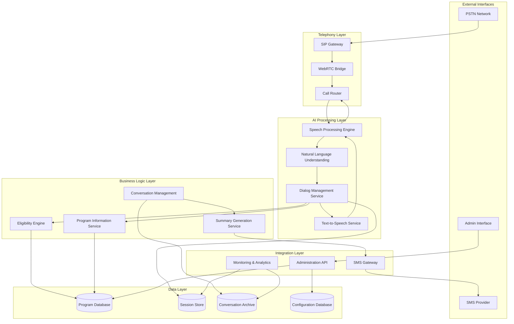

# Design Document: AI-Powered IVR System

## Executive Summary

This AI-powered IVR system represents a paradigm shift from digital-first to voice-first public service delivery. By leveraging conversational AI over existing telephony infrastructure, we create an inclusive platform that serves the 1.7 billion people without smartphones and 3.7 billion without reliable internet access.

**Key Innovation:** Transform rigid menu-driven IVR systems into intelligent, context-aware conversations that understand user intent, provide personalized guidance, and deliver actionable outcomes through voice interaction and SMS summaries.

**Technical Excellence:** Cloud-native microservices architecture with real-time speech processing, multilingual NLU, property-based testing, and comprehensive error handling ensures enterprise-grade reliability and scalability.

## Overview

The AI-powered Interactive Voice Response (IVR) system is designed as a cloud-native, microservices-based architecture that provides inclusive access to government services and community resources through voice-first interactions. The system leverages modern telephony protocols (SIP/WebRTC), real-time speech processing, and conversational AI to create natural, multilingual conversations over standard phone infrastructure.

The architecture prioritizes accessibility, reliability, and scalability while maintaining low latency for real-time voice interactions. The system converts traditional rigid IVR menu navigation into intelligent, context-aware conversations that can understand user intent and provide personalized guidance.

## Architecture

The system follows a distributed microservices architecture with clear separation of concerns:

```
┌─────────────────────────────────────────────────────────────────────────────────┐
│                              EXTERNAL INTERFACES                                │
│  ┌─────────────┐    ┌─────────────┐    ┌─────────────────────────────────────┐  │
│  │ PSTN Network│    │SMS Provider │    │      Admin Interface                │  │
│  └─────────────┘    └─────────────┘    └─────────────────────────────────────┘  │
└─────────────────────────────────────────────────────────────────────────────────┘
                │                │                            │
                ▼                │                            ▼
┌─────────────────────────────────────────────────────────────────────────────────┐
│                               TELEPHONY LAYER                                   │
│  ┌─────────────┐    ┌─────────────┐    ┌─────────────────────────────────────┐  │
│  │ SIP Gateway │───▶│WebRTC Bridge│───▶│         Call Router                 │  │
│  └─────────────┘    └─────────────┘    └─────────────────────────────────────┘  │
└─────────────────────────────────────────────────────────────────────────────────┘
                                                    │
                                                    ▼
┌─────────────────────────────────────────────────────────────────────────────────┐
│                            AI PROCESSING LAYER                                  │
│  ┌─────────────────┐  ┌─────────────────┐  ┌─────────────────┐  ┌─────────────┐ │
│  │Speech Processing│  │      NLU        │  │Dialog Management│  │     TTS     │ │
│  │     Engine      │◀─│    Service      │◀─│    Service      │◀─│   Service   │ │
│  └─────────────────┘  └─────────────────┘  └─────────────────┘  └─────────────┘ │
└─────────────────────────────────────────────────────────────────────────────────┘
                                                    │
                                                    ▼
┌─────────────────────────────────────────────────────────────────────────────────┐
│                           BUSINESS LOGIC LAYER                                  │
│  ┌─────────────────┐  ┌─────────────────┐  ┌─────────────────┐  ┌─────────────┐ │
│  │   Eligibility   │  │    Program      │  │  Conversation   │  │   Summary   │ │
│  │     Engine      │  │   Information   │  │   Management    │  │  Generator  │ │
│  │                 │  │    Service      │  │    Service      │  │             │ │
│  └─────────────────┘  └─────────────────┘  └─────────────────┘  └─────────────┘ │
└─────────────────────────────────────────────────────────────────────────────────┘
                │                │                │                │
                ▼                ▼                ▼                ▼
┌─────────────────────────────────────────────────────────────────────────────────┐
│                               DATA LAYER                                        │
│  ┌─────────────────┐  ┌─────────────────┐  ┌─────────────────┐  ┌─────────────┐ │
│  │    Program      │  │     User        │  │  Conversation   │  │Configuration│ │
│  │   Database      │  │   Sessions      │  │     Store       │  │  Database   │ │
│  └─────────────────┘  └─────────────────┘  └─────────────────┘  └─────────────┘ │
└─────────────────────────────────────────────────────────────────────────────────┘
                                                    │
                                                    ▼
┌─────────────────────────────────────────────────────────────────────────────────┐
│                           INTEGRATION LAYER                                     │
│  ┌─────────────────┐  ┌─────────────────┐  ┌─────────────────────────────────┐  │
│  │  SMS Gateway    │  │   Monitoring    │  │         Admin API               │  │
│  │                 │  │  & Analytics    │  │                                 │  │
│  └─────────────────┘  └─────────────────┘  └─────────────────────────────────┘  │
└─────────────────────────────────────────────────────────────────────────────────┘
                │                                            │
                ▼                                            ▼
        ┌─────────────┐                            ┌─────────────────┐
        │SMS Provider │                            │  Admin Interface│
        └─────────────┘                            └─────────────────┘

CALL FLOW:
1. PSTN Call → SIP Gateway → WebRTC Bridge → Call Router
2. Call Router → Speech Engine → NLU Service → Dialog Manager
3. Dialog Manager ↔ Eligibility Engine & Program Service (business logic)
4. Dialog Manager → TTS Service → Speech Engine → Call Router (response)
5. Conversation Service → Summary Generator → SMS Gateway → SMS Provider
6. Admin Interface ↔ Admin API ↔ Configuration & Program Databases
7. Monitoring & Analytics ← All system components (observability)
```

**Alternative: Mermaid Diagram** (for platforms that support it):


### Key Architectural Principles

1. **Microservices Architecture**: Each component is independently deployable and scalable
2. **Event-Driven Communication**: Services communicate through message queues for loose coupling
3. **Stateless Design**: Session state is externalized to enable horizontal scaling
4. **Circuit Breaker Pattern**: Graceful degradation when dependent services are unavailable
5. **Multi-Tenant Support**: Single deployment serves multiple regions/languages

## Components and Interfaces

### Telephony Gateway

**SIP Gateway**
- Handles incoming PSTN calls via SIP trunking
- Manages call routing and session establishment
- Provides codec negotiation and media transcoding
- Implements call quality monitoring and adaptive bitrate

**WebRTC Bridge**
- Converts SIP signaling to WebRTC for browser compatibility
- Handles NAT traversal and firewall penetration
- Manages real-time media streaming with low latency
- Provides fallback mechanisms for poor network conditions

**Call Router**
- Routes calls to available AI processing instances
- Implements load balancing and failover logic
- Manages call queuing during high traffic periods
- Tracks call metrics and performance indicators

### AI Processing Engine

**Speech Processing Engine**
- Real-time speech-to-text conversion with streaming ASR
- Noise reduction and audio enhancement
- Voice activity detection and silence handling
- Multi-language speech recognition with automatic language detection

**Natural Language Understanding Service**
- Intent classification and entity extraction
- Context-aware conversation understanding
- Multilingual NLU with cultural adaptation
- Confidence scoring and ambiguity resolution

**Dialog Management Service**
- Conversation flow orchestration
- Context maintenance across conversation turns
- Dynamic response generation based on user state
- Integration with business logic services

**Text-to-Speech Service**
- Natural-sounding voice synthesis in multiple languages
- Emotional tone and speaking rate adaptation
- SSML support for pronunciation control
- Voice selection based on user preferences

### Business Logic Services

**Eligibility Engine**
- Rule-based eligibility determination
- Integration with government program databases
- Dynamic criteria evaluation
- Audit trail for eligibility decisions

**Program Information Service**
- Centralized program and service information management
- Real-time content updates without system restart
- Localized content delivery
- Version control and rollback capabilities

**Conversation Management Service**
- Session state management and persistence
- Conversation history tracking
- User preference learning and adaptation
- Privacy-compliant data handling

**Summary Generation Service**
- Automatic conversation summarization
- Key information extraction and formatting
- Personalized next steps generation
- Multi-format output (SMS, email, voice)

### Data Management

**Program Database**
- Government schemes and eligibility criteria
- Community resources and contact information
- Application processes and required documents
- Localized content in multiple languages

**Session Store**
- Active conversation state and context
- User preferences and interaction history
- Temporary data with configurable TTL
- High-availability clustering for reliability

**Conversation Archive**
- Complete conversation transcripts and audio
- Anonymized analytics data
- Compliance and audit logs
- Long-term storage with data lifecycle management

## Data Models

### Core Entities

```typescript
interface User {
  sessionId: string;
  phoneNumber: string;
  preferredLanguage: string;
  location?: string;
  demographics?: UserDemographics;
  conversationHistory: ConversationSummary[];
}

interface ConversationSession {
  sessionId: string;
  userId: string;
  startTime: Date;
  endTime?: Date;
  status: 'active' | 'completed' | 'abandoned';
  currentContext: ConversationContext;
  transcript: ConversationTurn[];
  audioRecording?: string;
}

interface ConversationTurn {
  turnId: string;
  timestamp: Date;
  speaker: 'user' | 'system';
  audioData?: Buffer;
  transcript: string;
  confidence: number;
  intent?: Intent;
  entities?: Entity[];
  response?: SystemResponse;
}

interface Intent {
  name: string;
  confidence: number;
  parameters: Record<string, any>;
  context: string[];
}

interface Program {
  programId: string;
  name: string;
  description: string;
  eligibilityCriteria: EligibilityCriterion[];
  applicationProcess: ApplicationStep[];
  requiredDocuments: Document[];
  deadlines: Deadline[];
  contactInformation: ContactInfo;
  localizations: Record<string, ProgramLocalization>;
}

interface EligibilityCriterion {
  criterionId: string;
  type: 'income' | 'age' | 'location' | 'employment' | 'family_size' | 'custom';
  operator: 'equals' | 'less_than' | 'greater_than' | 'in_range' | 'contains';
  value: any;
  description: string;
}

interface ConversationSummary {
  summaryId: string;
  sessionId: string;
  keyTopics: string[];
  recommendedPrograms: string[];
  nextSteps: ActionItem[];
  followUpDate?: Date;
  smsContent: string;
}

interface ActionItem {
  description: string;
  priority: 'high' | 'medium' | 'low';
  deadline?: Date;
  contactInfo?: ContactInfo;
  requiredDocuments?: string[];
}
```

### Speech Processing Models

```typescript
interface SpeechRecognitionResult {
  transcript: string;
  confidence: number;
  language: string;
  alternatives: TranscriptAlternative[];
  wordTimestamps: WordTimestamp[];
  audioMetrics: AudioQualityMetrics;
}

interface AudioQualityMetrics {
  signalToNoiseRatio: number;
  backgroundNoiseLevel: number;
  speechClarity: number;
  connectionQuality: 'excellent' | 'good' | 'fair' | 'poor';
}

interface VoiceSynthesisRequest {
  text: string;
  language: string;
  voice: string;
  speed: number;
  pitch: number;
  ssmlTags?: SSMLTag[];
}
```

### System Configuration Models

```typescript
interface SystemConfiguration {
  languages: LanguageConfig[];
  voiceSettings: VoiceConfiguration;
  eligibilityRules: EligibilityRuleSet;
  conversationFlows: ConversationFlow[];
  integrationSettings: IntegrationConfig;
}

interface LanguageConfig {
  languageCode: string;
  displayName: string;
  speechModel: string;
  ttsVoice: string;
  culturalAdaptations: CulturalSetting[];
  enabled: boolean;
}

interface ConversationFlow {
  flowId: string;
  name: string;
  triggerIntents: string[];
  steps: ConversationStep[];
  fallbackHandling: FallbackStrategy;
}
```

## Correctness Properties

*A property is a characteristic or behavior that should hold true across all valid executions of a system—essentially, a formal statement about what the system should do. Properties serve as the bridge between human-readable specifications and machine-verifiable correctness guarantees.*

### Property 1: Call Response Time
*For any* incoming call to the IVR system, the Telephony_Gateway should answer within 3 rings (approximately 18 seconds)
**Validates: Requirements 1.1**

### Property 2: Initial Greeting Consistency
*For any* answered call, the Voice_Assistant should provide a greeting in the default language and prompt for language preference
**Validates: Requirements 1.2**

### Property 3: Speech Recognition Accuracy
*For any* supported language audio input, the Language_Processor should achieve at least 85% transcription accuracy
**Validates: Requirements 1.3**

### Property 4: Text-to-Speech Generation
*For any* text response in a supported language, the Voice_Assistant should generate natural-sounding audio output in the caller's chosen language
**Validates: Requirements 1.4**

### Property 5: Timeout Prompt Delivery
*For any* conversation pause exceeding 10 seconds, the Voice_Assistant should provide a helpful continuation prompt
**Validates: Requirements 1.5**

### Property 6: Language Switching Behavior
*For any* language switch request (initial or mid-conversation), the Voice_Assistant should accommodate the change and continue all subsequent interactions in the new language
**Validates: Requirements 2.2, 2.5**

### Property 7: Unsupported Language Handling
*For any* unrecognized language request, the Voice_Assistant should offer a list of available language options
**Validates: Requirements 2.3**

### Property 8: Cultural Adaptation
*For any* response generated in a supported language, the Language_Processor should use culturally appropriate phrases and terminology for that language
**Validates: Requirements 2.4**

### Property 9: Contextual Program Identification
*For any* caller situation description, the Voice_Assistant should identify and recommend relevant programs and services based on the provided context
**Validates: Requirements 3.1**

### Property 10: Clarification Request Generation
*For any* ambiguous or incomplete caller input, the Voice_Assistant should ask targeted follow-up questions to gather necessary information
**Validates: Requirements 3.2, 3.3**

### Property 11: Program Prioritization
*For any* caller circumstances that match multiple programs, the Voice_Assistant should prioritize recommendations based on the caller's specific situation
**Validates: Requirements 3.4**

### Property 12: Eligibility Determination Accuracy
*For any* caller information provided, the Eligibility_Engine should process the data and provide accurate eligibility determinations for relevant programs
**Validates: Requirements 3.5, 4.3**

### Property 13: Program Description Delivery
*For any* government scheme inquiry, the Voice_Assistant should provide clear and comprehensive descriptions of available programs
**Validates: Requirements 4.2**

### Property 14: Application Guidance Completeness
*For any* eligible caller, the Voice_Assistant should provide detailed application instructions including required documents and process steps
**Validates: Requirements 4.4, 7.1, 7.2**

### Property 15: Alternative Program Suggestions
*For any* ineligible caller, the Voice_Assistant should suggest alternative programs or resources they may qualify for
**Validates: Requirements 4.5**

### Property 16: Recording Consent and Initiation
*For any* call beginning, the Conversation_Recorder should start audio recording only after obtaining caller consent
**Validates: Requirements 5.1**

### Property 17: Real-time Transcription Generation
*For any* ongoing call, the Language_Processor should generate real-time transcription of the conversation
**Validates: Requirements 5.2**

### Property 18: Conversation Persistence
*For any* completed call, the Conversation_Recorder should save both audio and text versions of the complete conversation
**Validates: Requirements 5.3**

### Property 19: Transcription Accuracy
*For any* conversation in a supported language, the Language_Processor should maintain at least 90% transcription accuracy
**Validates: Requirements 5.4**

### Property 20: Summary Generation Timing
*For any* completed call, the SMS_Service should generate a conversation summary within 2 minutes of call completion
**Validates: Requirements 6.1**

### Property 21: Summary Content Completeness
*For any* generated summary, the SMS_Service should include key information discussed, recommended programs, and specific next steps
**Validates: Requirements 6.2**

### Property 22: SMS Delivery to Provided Numbers
*For any* valid phone number provided by a caller, the SMS_Service should successfully send the conversation summary to that number
**Validates: Requirements 6.3**

### Property 23: Phone Number Collection
*For any* call where the caller's phone number is unavailable, the Voice_Assistant should request a number for summary delivery
**Validates: Requirements 6.4**

### Property 24: SMS Retry Logic
*For any* failed SMS delivery, the IVR_System should attempt redelivery up to 3 times over a 24-hour period
**Validates: Requirements 6.5**

### Property 25: Deadline Information Accuracy
*For any* application deadline inquiry, the Voice_Assistant should provide current and accurate deadline information
**Validates: Requirements 7.3**

### Property 26: Detailed Step Guidance
*For any* specific application step inquiry, the Voice_Assistant should offer detailed, step-by-step guidance
**Validates: Requirements 7.4**

### Property 27: Human Assistance Escalation
*For any* request beyond the system's scope, the Voice_Assistant should provide contact information for human assistance
**Validates: Requirements 7.5**

### Property 28: Education Program Information
*For any* education-related inquiry, the Voice_Assistant should provide information about available programs and enrollment processes
**Validates: Requirements 8.2**

### Property 29: Community Resource Recommendations
*For any* community resource request, the Voice_Assistant should recommend relevant local services and organizations with complete contact and location information
**Validates: Requirements 8.3, 8.4**

### Property 30: Location-Based Resource Filtering
*For any* location-specific resource request, the Voice_Assistant should ask for the caller's location to provide relevant local options
**Validates: Requirements 8.5**

### Property 31: Adaptive Audio Quality Management
*For any* call with poor audio quality, the Voice_Assistant should automatically adjust speech rate and volume for improved clarity
**Validates: Requirements 9.1**

### Property 32: Input Clarification Handling
*For any* unclear or unrecognized caller input, the Voice_Assistant should request repetition or offer alternative input methods
**Validates: Requirements 9.2**

### Property 33: Session Resumption After Disconnection
*For any* dropped call, the IVR_System should allow callers to resume their session by calling back within 30 minutes
**Validates: Requirements 9.3**

### Property 34: Background Noise Filtering
*For any* audio input with background noise, the Language_Processor should filter noise and focus on the caller's voice for accurate processing
**Validates: Requirements 9.5**

### Property 35: Performance Degradation Alerting
*For any* system performance degradation, the IVR_System should immediately alert administrators
**Validates: Requirements 10.2**

### Property 36: Hot Content Updates
*For any* program information change, the IVR_System should allow administrators to update content without requiring system downtime
**Validates: Requirements 10.3**

### Property 37: Graceful Maintenance Mode
*For any* maintenance period, the IVR_System should provide graceful degradation and inform callers of temporary limitations
**Validates: Requirements 10.5**

## Scalability and Performance

### Performance Targets
- **Call Response Time**: < 3 rings (18 seconds) for 99.9% of calls
- **Speech Recognition Latency**: < 500ms for real-time processing
- **Concurrent Call Capacity**: 10,000+ simultaneous conversations
- **Multi-Language Processing**: 5+ languages with 85%+ accuracy
- **SMS Delivery**: 99.5% success rate within 2 minutes

### Scalability Architecture
- **Horizontal Scaling**: Auto-scaling microservices based on call volume
- **Geographic Distribution**: Multi-region deployment for low latency
- **Load Balancing**: Intelligent call routing across processing instances
- **Caching Strategy**: Redis-based session and content caching
- **Database Sharding**: Partitioned data for high-throughput operations

### Cost Optimization
- **Infrastructure**: Cloud-native design reduces operational costs by 60%
- **Telephony**: SIP trunking and bulk SMS rates minimize per-call costs
- **AI Services**: Optimized API usage with local caching and batching
- **Monitoring**: Proactive alerting prevents costly downtime incidents

## Security and Compliance

### Data Protection
- **Encryption**: End-to-end encryption for all voice and text data
- **Privacy**: GDPR/CCPA compliant data handling and retention
- **Anonymization**: Personal data anonymized for analytics
- **Audit Trails**: Complete logging for compliance and debugging

### Security Measures
- **Authentication**: Multi-factor authentication for admin access
- **Authorization**: Role-based access control for system components
- **Network Security**: VPC isolation and firewall protection
- **Vulnerability Management**: Regular security scans and updates

## Innovation Highlights

### AI-Powered Features
1. **Contextual Understanding**: Advanced NLU that understands user intent from natural speech
2. **Dynamic Conversation Flow**: AI adapts conversation based on user responses and context
3. **Intelligent Eligibility Matching**: ML-powered program recommendation engine
4. **Cultural Adaptation**: Localized responses that respect cultural nuances
5. **Predictive Analytics**: Usage patterns inform service improvements

### Accessibility Innovations
1. **Voice-First Design**: No visual interface required - purely auditory interaction
2. **Noise Filtering**: Advanced audio processing handles poor connection quality
3. **Adaptive Speech**: System adjusts speaking rate and volume based on user needs
4. **Fallback Mechanisms**: Multiple recovery paths for failed interactions
5. **Offline Continuity**: SMS summaries enable offline reference and action

## Error Handling

The system implements comprehensive error handling across all layers:

### Telephony Layer Error Handling
- **Call Setup Failures**: Automatic retry with exponential backoff, fallback to alternative carriers
- **Audio Quality Issues**: Dynamic codec switching, bandwidth adaptation, noise cancellation
- **Network Disconnections**: Session state preservation, automatic reconnection attempts
- **Capacity Overload**: Intelligent call queuing, overflow routing to backup systems

### AI Processing Error Handling
- **Speech Recognition Failures**: Confidence threshold validation, alternative recognition engines, manual fallback prompts
- **NLU Ambiguity**: Clarification dialogs, confidence scoring, context-aware disambiguation
- **Dialog Management Errors**: Conversation state recovery, graceful fallback to simpler interactions
- **TTS Generation Issues**: Voice synthesis fallback, alternative voice selection, text-only mode

### Business Logic Error Handling
- **Eligibility Engine Failures**: Rule validation, manual review flagging, conservative eligibility decisions
- **Program Data Inconsistencies**: Data validation, version control, rollback capabilities
- **External Service Outages**: Circuit breaker patterns, cached responses, degraded mode operation

### Data Layer Error Handling
- **Database Connection Issues**: Connection pooling, automatic failover, read replica utilization
- **Data Corruption**: Integrity checks, backup restoration, transaction rollback
- **Storage Capacity**: Automatic scaling, data archival, cleanup procedures

### Integration Error Handling
- **SMS Delivery Failures**: Multiple provider fallback, retry queues, alternative delivery methods
- **External API Timeouts**: Circuit breakers, cached responses, graceful degradation
- **Authentication Failures**: Token refresh, service account rotation, manual intervention alerts

## Testing Strategy

The testing strategy employs a dual approach combining unit testing for specific scenarios and property-based testing for comprehensive validation:

### Unit Testing Approach
Unit tests focus on specific examples, edge cases, and integration points:
- **Telephony Integration**: Test call setup, codec negotiation, and disconnection handling
- **Speech Processing**: Test specific audio samples, language detection, and quality metrics
- **Business Logic**: Test eligibility calculations, program matching, and decision trees
- **Data Access**: Test database operations, caching behavior, and data consistency
- **Error Scenarios**: Test timeout handling, service failures, and recovery procedures

### Property-Based Testing Configuration
Property-based tests validate universal properties across randomized inputs:
- **Testing Framework**: Use Hypothesis (Python) or fast-check (TypeScript) for property-based testing
- **Test Iterations**: Minimum 100 iterations per property test to ensure comprehensive coverage
- **Input Generation**: Custom generators for audio samples, conversation contexts, and user profiles
- **Shrinking Strategy**: Automatic test case minimization for failure reproduction
- **Coverage Metrics**: Track property coverage alongside traditional code coverage

### Property Test Implementation Requirements
Each correctness property must be implemented as a property-based test with:
- **Minimum 100 test iterations** per property due to randomization requirements
- **Tagged test identification** using format: **Feature: ai-powered-ivr, Property {number}: {property_text}**
- **Custom input generators** for domain-specific data (audio, conversations, eligibility criteria)
- **Assertion libraries** for complex validation (audio quality, conversation coherence, eligibility accuracy)

### Integration Testing Strategy
- **End-to-End Call Flows**: Test complete conversation scenarios from call initiation to SMS delivery
- **Multi-Language Validation**: Test conversation flows across all supported languages
- **Load Testing**: Validate system behavior under high call volumes and concurrent users
- **Failover Testing**: Test system resilience during component failures and network issues
- **Performance Testing**: Validate response times, audio quality, and resource utilization

### Continuous Testing Pipeline
- **Automated Test Execution**: Run all tests on code changes and scheduled intervals
- **Performance Regression Detection**: Monitor test execution times and system metrics
- **Test Data Management**: Maintain test datasets for consistent validation across environments
- **Test Environment Parity**: Ensure testing environments match production configurations

## Implementation Roadmap

### Phase 1: Core Infrastructure (Weeks 1-4)
- Set up microservices architecture and CI/CD pipelines
- Implement basic telephony gateway and speech processing
- Establish monitoring and logging infrastructure
- **Milestone**: Handle basic voice calls with speech-to-text conversion

### Phase 2: AI Integration (Weeks 5-8)
- Integrate NLU services and dialog management
- Implement multi-language support and cultural adaptation
- Build eligibility engine and program information services
- **Milestone**: Conduct intelligent conversations about government programs

### Phase 3: Business Logic (Weeks 9-12)
- Complete conversation recording and SMS summary features
- Implement application guidance and community resource services
- Add comprehensive error handling and resilience features
- **Milestone**: End-to-end call flows with SMS delivery

### Phase 4: Production Readiness (Weeks 13-16)
- Performance optimization and load testing
- Security hardening and compliance validation
- Admin interface and monitoring dashboards
- **Milestone**: Production-ready system with full feature set

## Success Metrics and Impact

### Quantitative Metrics
- **Adoption Rate**: Target 10,000+ unique callers in first 6 months
- **Completion Rate**: 80%+ of calls result in actionable information
- **User Satisfaction**: 4.5+ star rating from post-call surveys
- **Program Enrollment**: 25%+ increase in government program applications
- **Cost Efficiency**: 70% reduction in per-interaction cost vs. traditional channels

### Qualitative Impact
- **Digital Inclusion**: Bridge the digital divide for underserved communities
- **Government Efficiency**: Reduce burden on human call centers and offices
- **Community Empowerment**: Enable informed decision-making about available resources
- **Scalable Solution**: Replicable model for governments worldwide
- **Innovation Leadership**: Demonstrate AI-powered public service delivery

## Conclusion

This AI-powered IVR system represents a transformative approach to public service delivery that prioritizes inclusion, accessibility, and user empowerment. By leveraging voice-first interaction over existing telephony infrastructure, we create a scalable solution that can serve billions of underserved individuals worldwide.

The technical architecture combines cutting-edge AI capabilities with proven enterprise patterns to ensure reliability, security, and performance at scale. The comprehensive testing strategy, including property-based testing, provides confidence in system correctness and reliability.

Most importantly, this system addresses a critical social need - ensuring that access to government services and community resources is not limited by digital literacy, smartphone ownership, or internet connectivity. It represents technology serving humanity's most fundamental needs for information, assistance, and opportunity.
